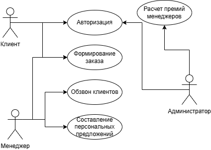
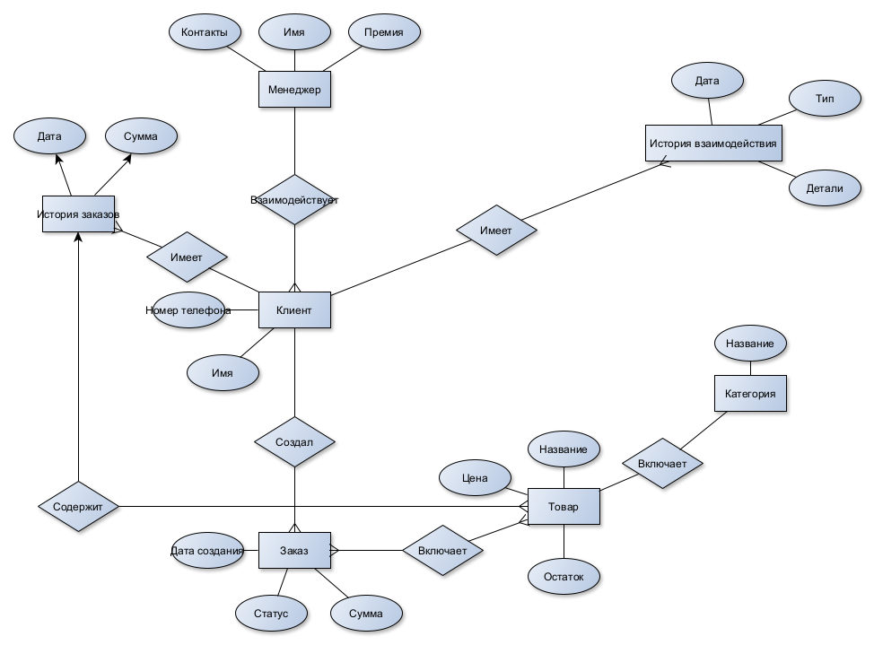
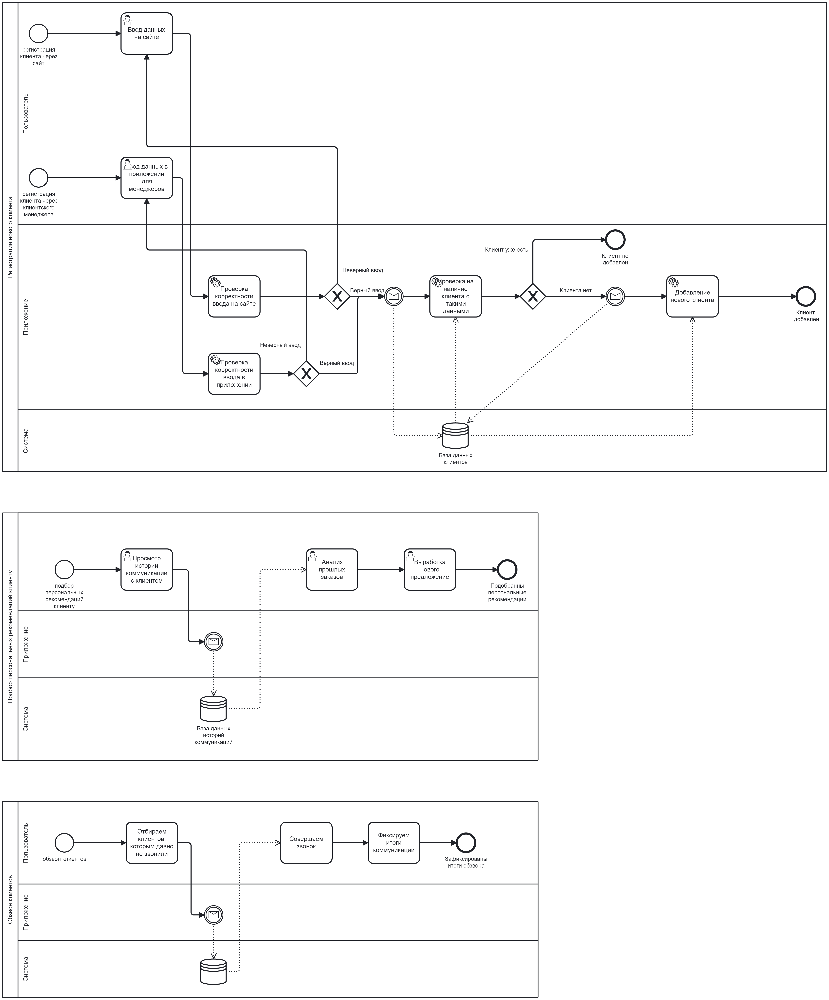
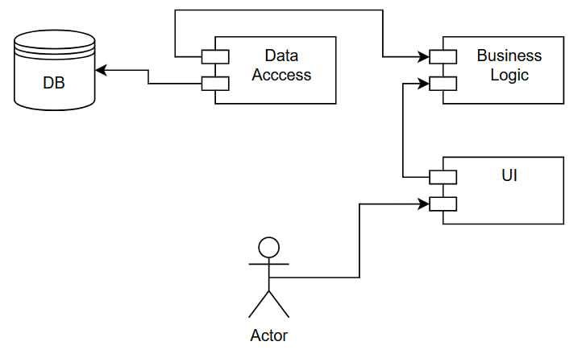
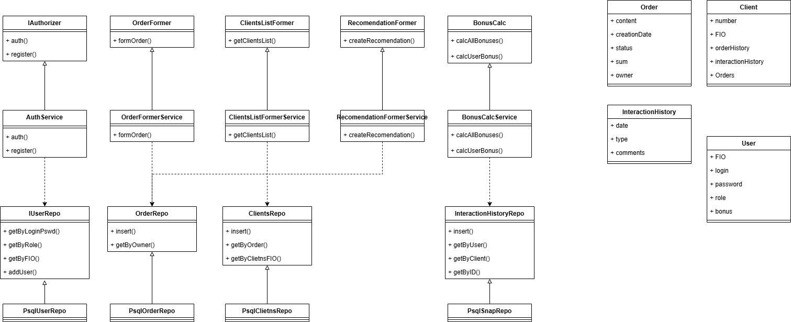

# ChairCRM. Система учета взаимоотношений с клиентами мебельного салона

---

## Описание

Система учета взаимоотношений с клиентами фиксирует взаимодействие клиентов с мебельным салоном, включая заказы, предпочтения и историю покупок. Пользователи могут просматривать только свои данные, в то время как менеджеры могут искать информацию по клиентам, заказам и товарам. Администраторы контролируют доступ к информации и ведут логи всех действий.

---

## Предметная область

Системы учета взаимоотношений с клиентами (CRM) позволяют оптимизировать взаимодействие с клиентами, повысить уровень обслуживания и увеличить продажи. Они помогают менеджерам отслеживать предпочтения клиентов, управлять расписанием встреч и анализировать эффективность работы. Такие системы применяются в мебельном бизнесе для улучшения клиентского опыта и повышения лояльности.

---

## Конкуренты

| Критерий              | RetailCRM                        | AmoCRM                       | Битрикс 24                          |  ChairCRM |
|-----------------------|--------------------------------|-------------------------------------|---------------------------------------|-----|
| Функциональность      | Обзвон, аналитика  | Обзвон, аналитика, автоматизация воронки продаж                     | Обзвон, аналитика                       |  Обзвон, аналитика, персональные рекомендации|
| Целевая аудитория     | Магазины розничной торговли    | Товары и услуги       | Товары и услуги                    | Магазины мебели | 
| Способы хранения данных| Полностью облачное решение           | Полностью облачное решение         | Полностью облачное решение            |  Полностью облачное решение|

---

## Актуальность

Разработка системы учета взаимоотношений с клиентами мебельного салона актуальна в условиях конкуренции на рынке, необходимости повышения уровня сервиса и эффективного управления отношениями с клиентами. Внедрение подобной системы способствует увеличению продаж и повышению удовлетворенности клиентов.

---

## Роли

- Клиент - может создавать заказ
- Менеджер - может отслеживать заказы всех клиентов и взаимодействовать с ними
- Администратор - может контролировать доступ к данным и расчитывать премию менеджерам

---

## Usecase

---
## ER

---

## Пользовательские сценарии

- Клиент: Авторизуется, создает заказ;
- Менеджер: Авторизуется, отслеживает этапы заказов клиентов, обзванивает клиентов;
- Менеджер: Авторизуется, обзванивает клиентов, которым давно не звонили, фиксирует итоги звонка;
- Администратор: Авторизуется, расчитывает премию менеджерам.

---
## BPMN

---

## Описание типа приложения и выбранного

---

**Тип приложения:** Web MPA
**Технологический стэк:**

- ___backend:___ 
  - _Язык программирования:_ Python
  - _СУБД:_ PostgreSQL
- ___frontend:___ HTML, CSS, TypeScript

## Верхнеуровневое разбиение на компоненты

---

## Диаграммы классов

---

